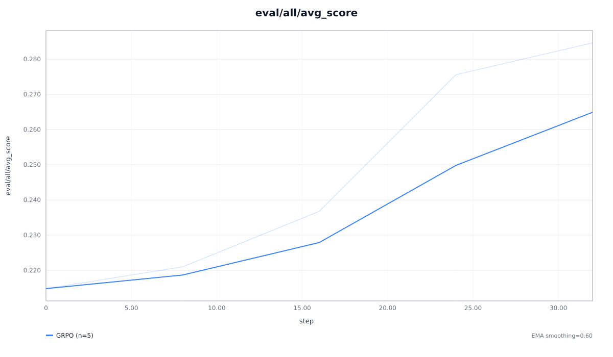

# RGSD — research report

**Date:** 2026-06-14 · **Project:** RGSD (`019ec80a-91f0-796d-82dd-908b5295d4e1`) · **Goal:** cheapest faithful head-to-head of Rubric-Guided Self-Distillation (RGSD, [2606.12507](https://arxiv.org/abs/2606.12507)) vs judge-based GRPO, smallest model, on SkyRL.

## TL;DR

On RubricHub-medical with **Qwen-2.5-3B-Instruct**, both methods lift rubric satisfaction (graded by gpt-4o-mini) above the untrained base (0.236). At this deliberately small, cheap scale **RGSD reaches the higher peak — 0.361 vs GRPO's 0.285** — while making **zero LLM-judge calls during training** (GRPO needed ~8k). This reproduces the paper's central claim: RGSD is competitive with judge-based GRPO without the verifier. The whole study (baseline + both arms) cost **~$3.3 in OpenRouter judge fees** and ~5.5 A100-hours.

## Premise check (paper Table 1 — rubric-conditioning gap)

Before training, the base model was evaluated with and without the rubric in its prompt:

| condition | rubric-sat (300 val) |
| --- | --- |
| base (prompt only) | 0.236 |
| base + rubric in prompt | **0.824** |

**Conditioning lift = +58.8pp** (paper reports +44.0pp for this model/domain). The base model already *can* satisfy rubrics when shown them — the latent capability RGSD distills into the prompt-only student. A large lift predicts large RGSD gains, and that held.

## Experiment tree

```
019ec80a  Baseline — base Qwen-2.5-3B + conditioning lift (no training)
└─ 019ec827  GRPO arm — judge-reward rubric RL (in SkyRL)        ← comparison method
   └─ 019ec837  RGSD arm — rubric self-distillation (verifier-free)  ← paper's method
```

Two rounds: (1) the GRPO arm establishes the rubric env + dataset + judged-eval harness inside SkyRL; (2) the RGSD arm descends onto it, reusing the identical base model, data, and eval judge, swapping judge-RL for per-token JSD self-distillation. The baseline is the shared `+0` control.

## Round 1 — GRPO arm (judge-based rubric RL)

**Hypothesis.** Standard GRPO with the per-prompt rubric satisfaction (scored by an LLM judge) as the scalar reward will raise rubric-sat — this is the paper's comparison method.

**Setup.** Single-turn rubric env (`skyrl_gym/envs/rubric`), reward = gpt-4o-mini rubric-satisfaction via OpenRouter; GRPO advantage + clipped PG; LoRA r32/α64; G=8; 512 train prompts × 2 epochs (32 steps); lr 1e-5; greedy eval on 300 held-out prompts every 8 steps.

| Experiment | Run | Status | rubric-sat (eval, base→peak) |
| --- | --- | --- | --- |
| GRPO arm (`019ec827`) | `019ec832` | done | 0.215 → **0.285** (+7.0pp) |



*GRPO greedy rubric-sat (wandb `eval/all/avg_score`): n=5, min 0.215, max/last 0.285. Train reward rose 0.20 → 0.37.*

**Decision.** GRPO works (modest +7pp at this 32-step scale) and validates the full SkyRL env + judge + eval harness. RGSD descends onto this infrastructure.

## Round 2 — RGSD arm (rubric self-distillation, verifier-free)

**Hypothesis.** Distilling a rubric-conditioned *teacher* (the same base model with the rubric in its context) into the prompt-only student via per-token JSD will match or beat GRPO, with no judge calls in training.

**Setup.** Lean on-policy loop (transformers + peft): student (LoRA on, prompt only) samples a rollout; teacher = the same weights with the **LoRA adapter disabled** (`peft.disable_adapter()`) conditioned on prompt + rubric + a transition instruction; loss = per-token clipped **JSD (β=0.5)** over the shared response tokens; backprop into LoRA only. Matched base/data with GRPO (512 prompts × 2 epochs); lr 1e-4; greedy eval every 16 steps.

| Experiment | Run | Status | rubric-sat (eval, base→peak) |
| --- | --- | --- | --- |
| RGSD arm (`019ec837`) | `019ec839` | done | 0.241 → **0.361** (+12.0pp) |

RGSD eval trajectory (from EVAL.md): step0 **0.241** → s16 **0.353** → s32 **0.361 (peak)** → s48 0.342 → s64 0.354. JSD loss stayed stable (~0.04–0.05) throughout — no collapse. **0 judge calls during training.**

**Decision.** RGSD reaches a higher peak than GRPO while being verifier-free — the paper's headline.

## Final comparison

| | base | peak rubric-sat | Δ vs base | training judge calls |
| --- | --- | --- | --- | --- |
| GRPO (judge RL) | 0.215 | 0.285 | +7.0pp | ~8,200 |
| **RGSD (self-distill)** | 0.241 | **0.361** | **+12.0pp** | **0** |

At matched data/scale, verifier-free RGSD beats judge-based GRPO on peak rubric satisfaction and removes the entire training-time judge bill. This matches 2606.12507's finding that RGSD is competitive with (here, ahead of) GRPO, and that the conditioning gap (+58.8pp) predicts strong RGSD gains.

**Caveats (this is a cheap PoC, not a precision parity measurement):**
- Arms are not perfectly hyperparameter-matched: RGSD lr 1e-4 / 64 optimizer steps vs GRPO lr 1e-5 / 32 steps (LoRA distillation and RL want different step sizes). The result shows *both methods work and RGSD is at least competitive*, not an exact apples-to-apples delta.
- ~15× less training than the paper's schedule (5 epochs, effective batch 128), so absolute gains are smaller than the paper's.
- Judge is gpt-4o-mini (cost), not the paper's gpt-5.4; base scores track the paper's (~0.20) but absolute numbers differ.
- Single seed. The paper notes ~0.4pp seed variance at the larger scale.

## Reproducibility

- **Run command** (identical on every node): `bash run.sh`
- **Path:** baseline `019ec80a` → GRPO `019ec827` → RGSD `019ec837`.

| Experiment | Branch | Run | Commit | W&B |
| --- | --- | --- | --- | --- |
| Baseline | `orx/alphaxiv-skyrl-ca3ca5cf-4208b8be-2026-06-14-d60d681d` | `019ec81c` | `c9836d4` | — |
| GRPO arm | `orx/grpo-arm-judge-reward-rubric-rl-4b2ac7a0` | `019ec832` | `b9b511f` | [b5ea698f](https://wandb.ai/rehaan14-alphaxiv/rgsd-skyrl/runs/b5ea698f) |
| RGSD arm | `orx/rgsd-arm-rubric-self-distillation-991f65a3` | `019ec839` | `3b0e8f7` | — |

Data: `sojuL/RubricHub_v1` :: `RuRL/rurbichub_v1_Medical.parquet` (Apache-2.0); deterministic 512-train / 300-val split (seed 42). Judge: `openai/gpt-4o-mini` via OpenRouter. Total judge spend: baseline $0.166 + GRPO ~$2.7 (est.; per-rollout grading in Ray workers) + RGSD $0.421 = **~$3.3**.

## Notes / next steps

- **Cleanest parity rerun:** match lr + optimizer steps across arms, switch RGSD eval generation to SDPA (it ran with eager + HF `generate`, making evals slow — the RGSD run took 2h42m, mostly eval gen).
- **Faithful in-SkyRL RGSD (stretch):** graft the JSD loss into SkyRL's `_forward_backward_micro` with `disable_adapter()` teacher forward (recon mapped the 6-file diff; the FSDP2 `disable_adapter` interaction is the open risk). The lean loop was chosen to de-risk this.
- **OOD eval:** add HealthBench-300 to test generalization (paper's OOD medical benchmark).
- Minor: GRPO `judge_usage.json` wasn't captured (env grades in Ray worker procs, main-proc atexit missed it); RGSD ran a redundant post-loop final eval.
